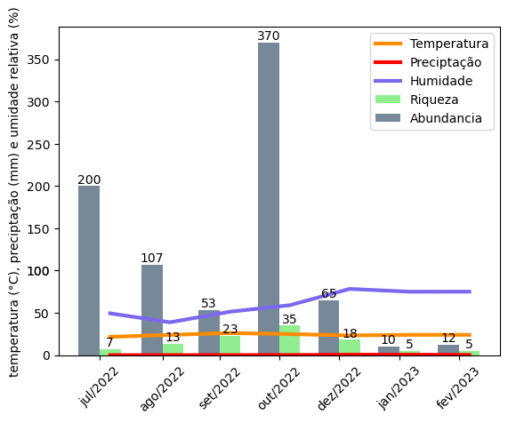

# Graficos-TCC-Stratiomyidae

## Índice

- [Introdução](#introdução)
- [Requisitos](#requisitos)
- [Instalação](#instalação)
- [Gráficos](#gráficos)
- [Contribuições](#contribuições)


## Introdução

Este projeto tem como objetivo gerar gráficos de riqueza, abundância, temperatura, umidade e precipitação, bem como um gráfico que junta todas essas informações. O projeto foi desenvolvido em Python, utilizando as bibliotecas pandas, matplotlib, matplotlib.pyplot e numpy.

## Requisitos

Para executar este projeto, você precisará dos seguintes requisitos:

- Python 3.7 ou superior
- Biblioteca pandas
- Biblioteca matplotlib
- Biblioteca matplotlib.pyplot
- Biblioteca numpy

## Instalação

Para instalar os requisitos, você pode usar o gerenciador de pacotes pip:

```bash
pip install pandas
pip install matplotlib
pip install matplotlib.pyplot
pip install numpy
```

## Gráficos

Todos os gráficos podem ser obtidos executando em ordem os seguintes arquivos: 

- riqueza.ipynb
- abundancia.ipynb
- metricas.ipynb
- graf_final.ipynb


Este é o gráfico de riqueza:


Este é o gráfico de abundancia:


Este é o gráfico de metricas:


Gráfico final do projeto:



## Contribuições

Contribuições para este projeto são bem-vindas. Para contribuir, basta enviar um pull request no repositório do projeto.

